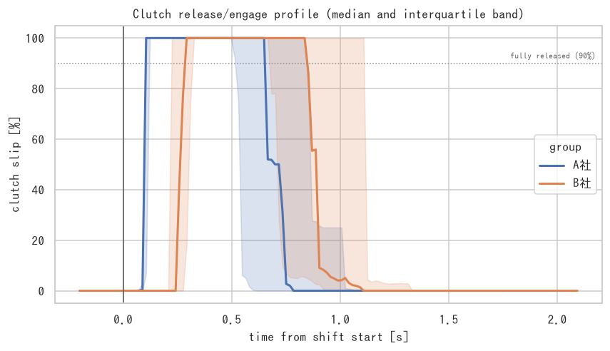
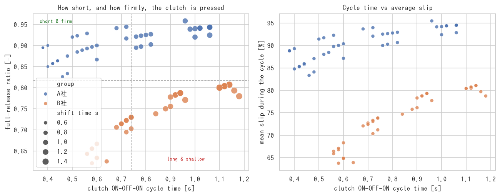

# amtlab — AMT 車両データ解析・変速適合最適化基盤

ローカルの [Ollama](https://ollama.com/) を前提にした、**AMT(自動MT: 乾式単板クラッチ + 有段ギヤ)車両の
変速品質データ解析システム**です。計測データは外に出さず、手元で

```
プラントモデル/実車ログ  →  変速イベント切り出し  →  KPI 抽出
        →  scikit-learn 代理モデル  →  Optuna 感度解析・適合最適化
        →  seaborn 可視化  →  Ollama によるレポート生成
```

までを一気通貫で回します。

---

## なにが解けるのか

AMT は変速中にクラッチを切るため、**必ず駆動トルクが抜けます(トルクホール)**。
そこでこのリポジトリは次の 3 点にフォーカスして解析します。

1. **変速時間** — 指令からトルク復帰完了まで
2. **車速の落ち込み** — 変速前後で車速がどれだけ削られたか
3. **カレントギア(現在ギア)** — どの段の変速が一番効いているか

### 車速の落ち込みは 2 通りで測る

| KPI | 意味 | 使いどころ |
| --- | --- | --- |
| `speed_drop_kmh` | 波形のピーク → 谷の落ち込み幅 | 実測ログからそのまま読める量 |
| `speed_loss_kmh` | 「変速しなかった場合」との最大差 | 変速そのものが奪った車速 |

全開アップシフトのように**車速は落ちないが伸びが止まる**条件では前者が 0 になり、
惰行ダウンシフトでは前者に走行抵抗ぶんの減速が混ざります。両方を常に併記し、
**最適化の目的関数には `speed_loss_kmh`** を使います
(理由と実測値は [`docs/methodology.md` §3.2](docs/methodology.md) に記載)。

副作用の監視として、変速ショック `jerk_rms` / `jerk_peak`、トルク抜け時間、
クラッチすべり仕事 `clutch_energy_j` も毎試行記録します。

## 車両プリセット

| プリセット | 内容 |
| --- | --- |
| `passenger6` | 乗用車 + 6 速 AMT(1500 kg、190 Nm)。既定 |
| `truck12` | **大型トラック + 12 速 AMT**(空車 16 t、13 L / 2300 Nm、直結トップ) |

```bash
amtlab ingest  --log logs/ --vehicle truck12
amtlab compare --group "A社=logs/A" --group "B社=logs/B" --vehicle truck12
amtlab run     --config configs/truck12.yaml
```

段数だけでなく、**適合値の探索範囲も車両に合わせて自動でスケール**します。
トルク勾配 [Nm/s] は最大トルク比(トラックは乗用車の約 12 倍)で、
同期すべりオフセット [rad/s] は回転域比(ディーゼルは狭い)でスケールします。
乗用車基準の値のままではトラックの変速は成立しません。

変速回転域も車両のトルク特性から決めます(トラック: 上げ 1320〜1890 rpm /
下げ 960〜1350 rpm、乗用車: 上げ 1650〜5775 rpm)。

> 12 速のログを既定プリセット(6 速)で読むと、7 速以上のギヤ比が引けずに
> エラーになります。`--vehicle truck12` を付けてください。
> ただし **SPN 526(実ギヤ比)がログにあれば、ギヤ比はログから取る**ので
> プリセットに依存しません。

## クイックスタート

```bash
pip install -e ".[parquet]"  # parquet を読むなら pyarrow が要る
# 依存: numpy / pandas / scipy / scikit-learn / optuna / seaborn / pyyaml

amtlab run --quick          # 小規模で一通り動かす(20 秒程度)
amtlab run --config configs/default.yaml   # 本番設定(数分)
```

`outputs/` に次の成果物が出ます。

```
outputs/
├── config.used.yaml         実行時の設定スナップショット
├── summary.json             LLM/レポートに渡した解析サマリ
├── report.md                Ollama(または内蔵テンプレート)による解析レポート
├── data/dataset.csv         DoE で生成した変速イベント(1 行 = 1 変速)
├── models/surrogate_*.joblib 学習済み代理モデル
├── tables/                  重要度・パレート解・改善率などの表
└── figures/                 seaborn による図一式
```

### サンプル結果(`configs/default.yaml`、600 イベント / 実行 92 秒)

Optuna(NSGA-II, 150 試行)による適合最適化のベースライン比:

| 指標 | ベースライン | 最適化後 | 変化 |
| --- | --- | --- | --- |
| `shift_time_s` [s] | 1.000 | 0.822 | **−17.8 %** |
| `speed_loss_kmh` [km/h] | 7.91 | 6.46 | **−18.3 %** |
| `speed_drop_kmh` [km/h] | 1.14 | 0.88 | −22.6 % |
| `torque_interrupt_s` [s] | 0.737 | 0.608 | −17.5 % |
| `jerk_peak` [m/s³] | 43.0 | 23.3 | −45.9 % |
| `clutch_energy_j` [J] | 12.8 | 34.6 | **+169 %**(速さの対価) |

代理モデルの CV 決定係数は `shift_time_s` **R²=0.92** / `speed_loss_kmh` **R²=0.94**。
**変速時間は運転条件だけでは R²=0.26 しか説明できず(適合値込みで 0.92)、
ほぼ適合値で決まる**ことが分かります。

<p align="center">
  
  
</p>

左: 2→3 速アップシフトの時系列。車速パネルに**落ち込み幅(ピーク→谷)と
「変速しなかった場合」の基準線**を重ねています。
右: 変速時間 × 車速損失のパレートフロント(色はジャーク、★ が重み付き最良解)。

#### カレントギア別の傾向


| 現在ギア | 変速時間 [s] | `speed_drop_kmh` | `speed_loss_kmh` |
| --- | --- | --- | --- |
| 1速 → 2速 | 1.35 | 1.45 | **8.81** |
| 2速 → 3速 | 1.12 | 1.05 | 5.06 |
| 3速 → 4速 | 1.00 | 1.31 | 2.84 |
| 4速 → 5速 | 0.84 | 1.32 | 1.89 |
| 5速 → 6速 | 0.87 | **2.08** | 1.36 |

2 つの指標は**ギヤに対して逆方向**に効きます。損失で見れば最悪は 1→2 速
(駆動力が大きいぶん奪われる車速も大きい)、実測の落ち込み幅で見れば高速段
(走行抵抗が大きく実際に減速する)。落ち込み幅だけを見ていると 1→2 速の問題を
見落とします。


変速時間の重要度 1 位は**カレントギア**(`from_gear`)、次いで適合値の
`sync_gain` と `clutch_close_rate` でした。


### 主なコマンド

| コマンド | 用途 |
| --- | --- |
| `amtlab run` | 解析パイプライン一式 |
| `amtlab simulate --scenario 2-3@45,0.7` | 単一変速の時系列シミュレーションと波形描画 |
| `amtlab dataset --samples 800` | ランダム DoE データセット生成のみ |
| `amtlab analyze --dataset path.csv` | 既存データセットから解析のみ |
| `amtlab calibrate --trials 200 --mode pareto` | 適合値の多目的最適化のみ |
| `amtlab inspect --log logs/` | ログの信号構成・サンプルレート診断(複数ファイル可) |
| `amtlab ingest --log logs/` | 実車ログから変速イベントを切り出して KPI 化(複数ファイル可) |
| `amtlab compare --group "A社=logs/A" --group "B社=logs/B"` | グループ間の比較(統計・条件補正つき) |
| `amtlab demo-log --j1939` | J1939 形式のデモログ生成 |
| `amtlab report --summary outputs/summary.json` | レポートだけ再生成(モデル差し替え検証に) |
| `amtlab ollama` | Ollama の疎通確認 |

## 実車ログを解析する(J1939 対応)

シミュレーションを使わず、**実測ログをそのまま**投入できます。
J1939(DBC デコード済み)なら列名を自動検出します。

```bash
amtlab inspect --log mylog.csv    # まず何が取れているか診断
amtlab ingest  --log mylog.csv    # 変速イベントを切り出して KPI 化
```

`inspect` は検出できた SPN・**実効サンプルレート**・注意点を出します。

```
  SPN  内部名                   列名                            実効Hz  信号
   84  speed_kmh             CCVS1::WheelBasedVehicleSpeed   10.0  ホイールベース車速
  190  engine_speed_rpm      EEC1::EngSpeed                  50.0  エンジン回転数
  191  output_shaft_rpm      ETC1::TransOutputShaftSpeed     50.0  アウトプットシャフト回転数
  522  clutch_slip_pct       ETC1::PercentClutchSlip         50.0  クラッチ滑り率
  523  gear                  ETC2::TransCurrentGear            離散  現在のギア位置
  574  shift_in_process      ETC1::TransShiftInProcess         離散  トランスシフトインプロセス

マッピングされなかった列 (2):
  CCVS1::ParkingBrakeSwitch
  ETC1::TransmissionDrivelineEngaged
```

### 列名の突き合わせ方

`EEC1::EngineSpeed` のような **メッセージ名プレフィックス + UpperCamelCase** に
対応しています。

- **プレフィックスを外して照合**します。区切りは `::` `:` `.` `/` `__`、および
  `EEC1_` のように「大文字+数字」トークンの後ろの `_`。
  `engine_speed` を `engine` + `speed` に割ってしまわないよう、小文字のトークンは
  プレフィックス扱いしません。外した本体と外さない全体の**両方**で照合するので、
  外して失敗することはありません。
- **UpperCamelCase を単語に分解**します(`TransCurrentGear` →
  `trans_current_gear`)。
- **略語をトークン単位で正式形に展開**します。DBC は
  `Transmission` → `Trans`、`Engine` → `Eng`、`Accelerator` → `Accel` のように
  略すのが普通なので、`TransShiftInProcess` → `transmission_shift_in_process`、
  `EngSpeed` → `engine_speed` に寄せてから照合します。トークン単位なので
  `TransDrivelineEngaged` の `Engaged` が `Engine` に化けることはありません。
- プレフィックスがその SPN の PGN と一致していれば**加点**します
  (`ETC1::` + シフトインプロセス など)。
- 別名は**特異度順**に評価します。たとえば SPN 512 (`DriversDemandEnginePercentTorque`)
  は SPN 2432 (`EngineDemandPercentTorque`) より優先され、取り違えません。
- 1 つの列が複数の信号の候補になった場合は、一致度の高い方に割り当て、
  負けた側は次点に回します(各列は最大 1 信号)。
- 対応表に無い列は**マッピングされずに一覧表示**されるので、
  取りこぼしがないか目で確認できます。

### この信号セットで何が測れるか

| 指標 | J1939 のみ | 使う SPN |
| --- | --- | --- |
| 変速時間(トルク相 / 締結相に分解) | ◎ 実測 | 574 + 522 |
| 車速の落ち込み・車速損失 | ◎ 実測 | 84 / 904 |
| トルク抜け時間・トルク復帰時間 | ◎ 実測 | 513 × 544 × 526、512 |
| クラッチすべり時間 | ◎ 実測 | 522 |
| 吹け上がり | ◎ 実測 | 190 vs 191 × 526 |
| **ジャーク(乗り心地)** | **△ 参考値** | 車体前後加速度の追加計測が必要 |

**ジャークだけは J1939 では定量評価できません。** 車速(SPN 84)は 10 Hz 程度でしか
更新されず、階段状の信号を微分すると量子化が偽のジャークになるためです
(自動でローパスを実効レートの 1/3 まで下げて暴走は防ぎます)。
50 Hz で来るアウトプットシャフト回転(SPN 191)は**駆動側の速度**なので、
微分すると乗り心地ではなく駆動軸のねじり振動を測ることになり、代用になりません
(`driveline_speed_kmh` として振動観察用にだけ保持)。
各イベントに `jerk_quality`(`measured`/`derived`/`low_rate`/`unusable`)を記録します。

→ **変速時間・車速の落ち込み・トルク抜けにフォーカスするなら、追加計測なしで
そのまま回せます。**

### 変速イベントの切り出し

**SPN 574(シフトインプロセス)があれば推定不要**で、フラグの立ち上がりが変速開始、
立ち下がりがギヤ入り。締結完了はクラッチ滑り率(SPN 522)が 1% を切った時刻。
したがって変速時間が

```
変速時間 = gear_engage_time_s (トルク相 + ギヤ入りまで) + clutch_close_time_s (締結)
```

に分解され、遅れがどちらの相にあるか切り分けられます。
SPN 574 が無い場合はギヤ信号(523)の遷移から推定します(ニュートラル経由に対応)。

### 自動検出が外れたとき

外れた信号だけを YAML に書けば上書きできます(明示 > 自動検出、残りは自動)。

```yaml
# signals.yaml
speed_kmh: "EBC2::FrontAxleSpeed"
gear: "MyLogger::GearPosition"
```

```bash
amtlab inspect --log mylog.csv --map signals.yaml
amtlab ingest  --log mylog.csv --map signals.yaml
```

単発なら CLI 引数でも指定できます。

```bash
amtlab ingest --log mylog.csv --col-gear GearPos --col-speed Vsp
```

```python
from amtlab.ingest import SignalMap, analyze_log

trace, events = analyze_log("mylog.csv", SignalMap(gear="GearPos"))
print(events[["current_gear", "to_gear", "shift_time_s",
              "speed_drop_kmh", "speed_loss_kmh", "torque_interrupt_s"]])
```

出力はシミュレーションと**同じ KPI スキーマ**なので、`amtlab analyze` 以降
(代理モデル・カレントギア別集計・可視化)をそのまま適用できます。

### 大量のログをまとめて確認する

ディレクトリ / glob / 複数パスをそのまま渡せます(**parquet 対応**)。

```bash
amtlab inspect --log logs/                    # 全ファイルの信号構成を突き合わせ
amtlab ingest  --log logs/ --out outputs      # 全ファイルの変速イベントを1つの表に
amtlab ingest  --log "logs/2024-*/*.parquet" --jobs 8
```

parquet の列指向を活かして、**スキーマ(列名)だけ先に読んで、必要な信号の列だけ
ロード**します。数百列あるログでも読むのは 15 列程度。時系列はファイルごとに
捨ててKPI行だけ残すので、**メモリはファイル数ではなくイベント数にしか比例しません**。

`inspect` はファイル間の差分だけを出します。

```
14 ファイル(読み込み可 13 / 失敗 1)

全ファイルにある信号 (13): time, accel_pedal_pct, ... , gear_ratio
どのファイルにも無い信号 (1): friction_torque_pct

一部のファイルにしか無い信号:
  clutch_slip_pct: 1 ファイルで欠落 (legacy_logger.parquet)
  shift_in_process: 1 ファイルで欠落 (legacy_logger.parquet)
  [読み込み失敗] broken.parquet: ArrowInvalid: Parquet magic bytes not found ...
```

`ingest` は 1 ファイルの失敗で止まらず、最後に注意点をまとめます。

```
13/14 ファイル読み込み成功 / 変速イベント 52 件
  - 読み込みに失敗: 1 ファイル(broken.parquet — ArrowInvalid: ...)
  - 変速イベントの切り出し方法がファイル間で混在しています
    (gear_change, shift_in_process)。変速時間の定義が揃わないため比較には注意が必要です
```

**この警告が実務上いちばん効きます。** SPN 574 があるファイルと無いファイルが
混ざると、前者は「トルクダウン開始から」、後者は「ギヤ抜きから」変速時間を測るので、
**同じ土俵で比較できません**(本モデルで約 0.4 秒の系統差)。
`detection_source` 列で層別するか、揃うファイルだけで比較してください。

出力(`outputs/tables/`):

| ファイル | 内容 |
| --- | --- |
| `log_events.csv` | 全ファイルの変速イベント KPI(`source_file` 付き) |
| `log_files.csv` | ファイルごとの行数・時間・イベント数・エラー |
| `signal_presence.csv` | ファイル × 信号の有無 |
| `log_gear_summary.csv` | カレントギア別の集計(全ファイル横断) |

Python からも同じことができます。

```python
from amtlab.batch import analyze_logs, signal_presence

result = analyze_logs("logs/", n_jobs=8)
print(result.summary())
print(result.failures())          # 読めなかったファイルと理由
print(result.events.groupby("source_file")["shift_time_s"].median())
print(signal_presence("logs/"))   # データ本体は読まずに信号の有無だけ確認
```

時刻列は datetime / timedelta / 秒 / ミリ秒 のいずれでも自動で秒に揃えます。

### クラッチの切り方(ON-OFF)を見る

「変速は短いのに、クラッチはしっかり切れている」——手で波形を見て気づくような
操作の質を数値化します。すべり率(SPN 522)の 1 サイクルを分解します。

```
締結 ─→ 切り始め(release) ─→ 全切り(open) ─→ 繋ぎ(engage) ─→ 締結
        clutch_release_time_s   clutch_open_time_s   clutch_engage_time_s
        └────────────── clutch_cycle_time_s(ON-OFF-ON) ──────────────┘
```

| KPI | 意味 |
| --- | --- |
| `clutch_cycle_time_s` | **ギヤチェンジ中の ON-OFF の時間** |
| `clutch_open_time_s` | すべり率 90% 以上(全切り)の時間 |
| `clutch_full_release_ratio` | サイクルに占める全切りの割合。**短くてもしっかり切っているか** |
| `clutch_mean_slip_pct` | サイクル平均すべり率 |
| `clutch_release_rate_pct_s` / `clutch_engage_rate_pct_s` | 切り / 繋ぎのアクチュエータ速度 |

`clutch_actuation.png` は横軸にサイクル時間、縦軸に全切り比率を取った散布図で、
**左上ほど「短時間で済ませながらしっかり切っている」**操作です。
`clutch_profiles.png` は変速開始を 0 秒に揃えたすべり率の重ね描き(中央値と
四分位帯)で、立ち上がりの速さ・全切りの高さと長さ・繋ぎの傾きが直接見えます。



デモの A 社 / B 社で比べるとこうなります。

| グループ | サイクル時間 | 全切り比率 | 平均すべり率 |
| --- | --- | --- | --- |
| A社 | **0.69 s** | **0.91** | 90.5 % |
| B社 | 0.84 s | 0.73 | 74.1 % |

A 社は短いのに深く切っている、という読み方になります。



> **SPN 522 が無いログでは、この指標は測れません。** エンジン回転と入力軸回転の
> 差から代用値は作りますが、ニュートラル中の入力軸はクラッチから切り離されて
> 自由回転するため、**切り深さは分かりません**(過小評価になります)。
> 代用したかどうかは `clutch_slip_source` 列と `inspect` の警告に出ます。
> グループ間で出所が混ざっている場合は比較を止めます。

### A 社 vs B 社 を比較する

グループごとにログの置き場を指定すると、KPI の差を統計付きで出します。

```bash
amtlab compare --group "A社=logs/A" --group "B社=logs/B" --reference A社 --out outputs
```

```
基準グループ: A社

⚠ 比較可能性の注意:
  - 運転条件の共通サポートが 34% しかありません。層別(per_gear)と
    条件補正後の差(adjusted_diff)を優先してください

               kpi group  n  median_ref  median_group   diff  diff_pct  ci_low  ci_high  adjusted_diff    verdict
      shift_time_s    B社 40      0.7400        1.0800  0.340      45.9   0.290    0.390         0.303 悪化(効果量: 大)
    speed_loss_kmh    B社 40      4.2751        5.5334  1.258      29.4  -0.117    2.239         0.807 差は有意でない
torque_interrupt_s    B社 40      0.6550        0.7700  0.115      17.6   0.030    0.190         0.077 悪化(効果量: 小)
          jerk_rms    B社 40      4.0035        3.5226 -0.481     -12.0  -1.116   -0.011        -0.679 改善(効果量: 小)
```

#### 素朴に平均を比べてはいけない理由

このツールが単純な平均比較をしないのは、実データで必ず踏む罠が 2 つあるからです。

**1. 運転条件が揃っていない**

A 社のログが発進加速中心、B 社が高速巡航中心なら、変速時間の差は制御の差ではなく
**走らせ方の差**です。そこで 3 通りの見方を並べます。

| 見方 | 出力 | 意味 |
| --- | --- | --- |
| 素の差 | `diff` | 実際に観測された差(条件の偏りを含む) |
| 層別 | `group_per_gear.csv` | 同じカレントギア・同じ方向どうしの差 |
| 条件補正後 | `adjusted_diff` | **同じ運転条件に揃えたときの差**(標準化) |

`adjusted_diff` は「条件 + グループ」から KPI を学習し、同じ条件集合に対して
グループだけ入れ替えて予測した差の平均です(G-computation)。
素の差と条件補正後が食い違ったら、条件の偏りを疑ってください。
運転条件のカバー範囲は `condition_overlap.png` で目視できます。

**2. イベントが独立でない**

1 走行(1 ファイル)から複数の変速イベントが出るので、イベント単位で検定すると
n を過大に見積もり、差が実際より有意に見えます。信頼区間は
**ファイル単位のブートストラップ**で出しています。

さらに、統計以前の問題として **KPI の定義が揃っているか**を先に検証します。
A 社に SPN 574 があって B 社に無ければ、変速時間の起点が違う(約 0.4 秒の系統差)ので
比較は成立しません。この場合は比較表より先に警告が出ます。

出力:

| ファイル | 内容 |
| --- | --- |
| `tables/group_comparison.csv` | KPI ごとの差・CI・効果量・条件補正後の差 |
| `tables/group_per_gear.csv` | カレントギア別の層別比較 |
| `tables/condition_overlap.csv` | 運転条件の重なり |
| `figures/effect_sizes.png` | 差と信頼区間(フォレストプロット) |
| `figures/condition_overlap.png` | グループ別の運転条件カバー範囲 |
| `comparison_report.md` | Ollama(不可ならテンプレート)による比較レポート |

Python からも同じことができます。

```python
from amtlab.batch import analyze_logs
from amtlab.compare import compare_groups

batch = analyze_logs({"A社": "logs/A", "B社": "logs/B"}, n_jobs=8)
result = compare_groups(batch.events, reference="A社", files=batch.files)
print(result.summary())
```

3 グループ以上でも動きます(基準グループとの差を各グループについて出します)。

### 手元にログが無いとき

J1939 形式のデモログ(信号名・単位・PGN ごとの更新周期・分解能を模擬)を作れます。

```bash
amtlab demo-log --j1939 --out demo.csv && amtlab inspect --log demo.csv
```

## Python API

```python
from amtlab import ShiftControlParams, ShiftScenario, simulate_shift, extract_kpis
from amtlab.calibration import calibrate, CalibrationSetting
from amtlab.dataset import build_dataset
from amtlab.features import ObjectiveSpec, gear_summary

# 1 回の変速をシミュレーション
result = simulate_shift(ShiftControlParams(), ShiftScenario(2, 3, speed_kmh=45, throttle=0.6))
kpis = extract_kpis(result)
print(kpis["shift_time_s"], kpis["speed_drop_kmh"], kpis["speed_loss_kmh"])

# カレントギア別の傾向
print(gear_summary(build_dataset(300)))

# 目的を「変速時間 + 車速損失」の 2 つに絞って多目的最適化
spec = ObjectiveSpec.from_config(weights={"shift_time_s": 0.5, "speed_loss_kmh": 0.5})
outcome = calibrate(CalibrationSetting(objectives=spec), n_trials=150, mode="pareto")
print(outcome.improvement())   # 目的に入れなかった KPI も併記される
print(outcome.best_control)
```

目的 KPI は YAML でも差し替えられます。

```yaml
calibration:
  objectives: [shift_time_s, speed_loss_kmh]
  weights: {shift_time_s: 0.5, speed_loss_kmh: 0.5}
```

## Ollama の設定

`configs/default.yaml` の `ollama` セクション、または環境変数 `OLLAMA_HOST` で指定します。

```bash
ollama serve
ollama pull qwen2.5:7b
amtlab ollama          # 疎通確認
```

Ollama に接続できない場合は、**内蔵テンプレートによる決定論的レポート**へ自動フォールバックするため、
CI や LLM 無し環境でもパイプラインは止まりません。

## 構成

| モジュール | 役割 |
| --- | --- |
| `amtlab.simulation.vehicle` | エンジン・変速機・駆動系・車体の物理パラメータ |
| `amtlab.simulation.controller` | 変速シーケンス(状態機械)と適合パラメータ 8 種 |
| `amtlab.simulation.plant` | 4 状態の数値積分(クラッチすべり/ロック、駆動軸ねじり) |
| `amtlab.dataset` | 実験計画(DoE)とバッチ実行 |
| `amtlab.features` | 変速品質 KPI の抽出・カレントギア別集計・目的関数 |
| `amtlab.j1939` | J1939 信号の定義・自動検出・物理量変換・レート診断 |
| `amtlab.batch` | 複数ログ(parquet/CSV)の一括読み込みと突き合わせ |
| `amtlab.compare` | グループ間比較(層別・条件補正・クラスタブートストラップ) |
| `amtlab.ingest` | 実車ログの取り込み・イベント切り出し |
| `amtlab.modeling` | scikit-learn 代理モデル・感度解析 |
| `amtlab.tuning` | Optuna によるハイパーパラメータ探索 |
| `amtlab.calibration` | Optuna(TPE / NSGA-II)による適合最適化 |
| `amtlab.viz` | seaborn 可視化 |
| `amtlab.reporting` | Ollama クライアントとレポート生成 |
| `amtlab.pipeline` | 上記を束ねたパイプライン |

モデルの詳細(運動方程式・変速シーケンス・KPI 定義)は [`docs/methodology.md`](docs/methodology.md) を参照してください。

## 開発

```bash
pip install -e ".[dev]"
pytest -q          # 232 tests / 2 分程度
ruff check src tests
```

## ライセンス

MIT
