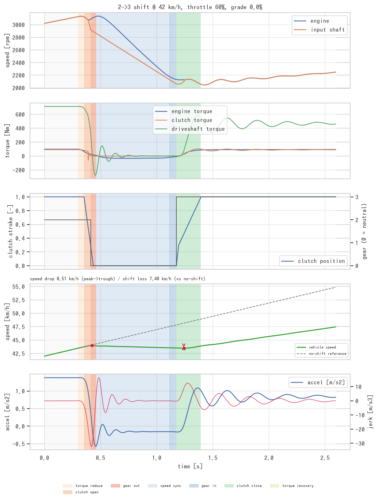
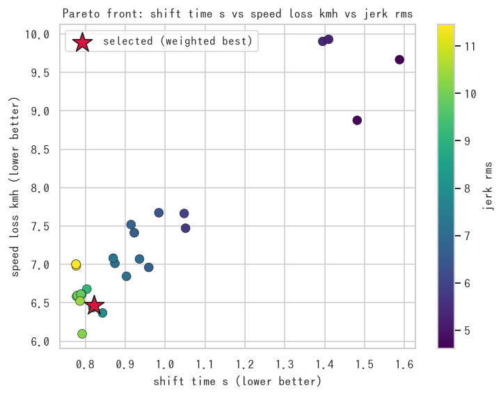
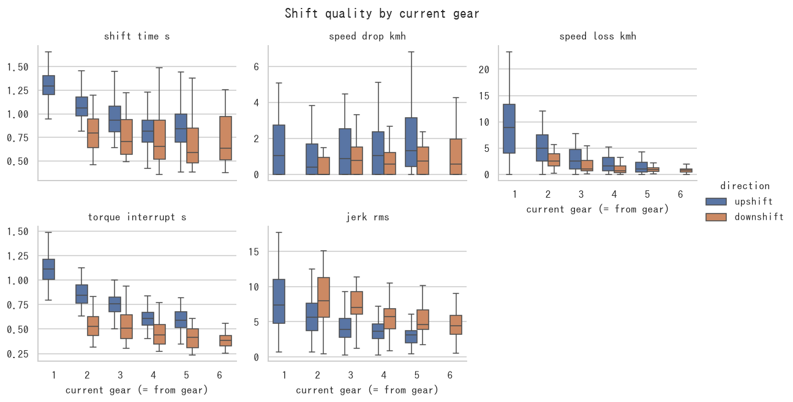
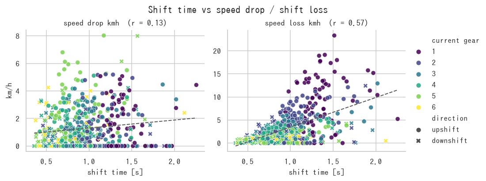
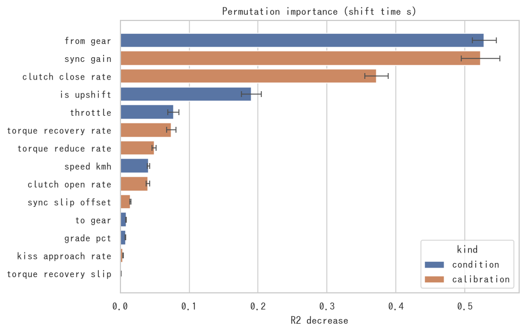

# amtlab — AMT 車両データ解析・変速適合最適化基盤

ローカルの [Ollama](https://ollama.com/) を前提にした、**AMT(自動MT: 乾式単板クラッチ + 有段ギヤ)車両の
変速品質データ解析システム**です。計測データは外に出さず、手元で

```
プラントモデル/実車ログ  →  変速イベント切り出し  →  KPI 抽出
        →  scikit-learn 代理モデル  →  Optuna 感度解析・適合最適化
        →  seaborn 可視化  →  Ollama によるレポート生成
```

までを一気通貫で回します。

---

## なにが解けるのか

AMT は変速中にクラッチを切るため、**必ず駆動トルクが抜けます(トルクホール)**。
そこでこのリポジトリは次の 3 点にフォーカスして解析します。

1. **変速時間** — 指令からトルク復帰完了まで
2. **車速の落ち込み** — 変速前後で車速がどれだけ削られたか
3. **カレントギア(現在ギア)** — どの段の変速が一番効いているか

### 車速の落ち込みは 2 通りで測る

| KPI | 意味 | 使いどころ |
| --- | --- | --- |
| `speed_drop_kmh` | 波形のピーク → 谷の落ち込み幅 | 実測ログからそのまま読める量 |
| `speed_loss_kmh` | 「変速しなかった場合」との最大差 | 変速そのものが奪った車速 |

全開アップシフトのように**車速は落ちないが伸びが止まる**条件では前者が 0 になり、
惰行ダウンシフトでは前者に走行抵抗ぶんの減速が混ざります。両方を常に併記し、
**最適化の目的関数には `speed_loss_kmh`** を使います
(理由と実測値は [`docs/methodology.md` §3.2](docs/methodology.md) に記載)。

副作用の監視として、変速ショック `jerk_rms` / `jerk_peak`、トルク抜け時間、
クラッチすべり仕事 `clutch_energy_j` も毎試行記録します。

## クイックスタート

```bash
pip install -e .            # 依存: numpy / pandas / scipy / scikit-learn / optuna / seaborn / pyyaml

amtlab run --quick          # 小規模で一通り動かす(20 秒程度)
amtlab run --config configs/default.yaml   # 本番設定(数分)
```

`outputs/` に次の成果物が出ます。

```
outputs/
├── config.used.yaml         実行時の設定スナップショット
├── summary.json             LLM/レポートに渡した解析サマリ
├── report.md                Ollama(または内蔵テンプレート)による解析レポート
├── data/dataset.csv         DoE で生成した変速イベント(1 行 = 1 変速)
├── models/surrogate_*.joblib 学習済み代理モデル
├── tables/                  重要度・パレート解・改善率などの表
└── figures/                 seaborn による図一式
```

### サンプル結果(`configs/default.yaml`、600 イベント / 実行 92 秒)

Optuna(NSGA-II, 150 試行)による適合最適化のベースライン比:

| 指標 | ベースライン | 最適化後 | 変化 |
| --- | --- | --- | --- |
| `shift_time_s` [s] | 1.000 | 0.822 | **−17.8 %** |
| `speed_loss_kmh` [km/h] | 7.91 | 6.46 | **−18.3 %** |
| `speed_drop_kmh` [km/h] | 1.14 | 0.88 | −22.6 % |
| `torque_interrupt_s` [s] | 0.737 | 0.608 | −17.5 % |
| `jerk_peak` [m/s³] | 43.0 | 23.3 | −45.9 % |
| `clutch_energy_j` [J] | 12.8 | 34.6 | **+169 %**(速さの対価) |

代理モデルの CV 決定係数は `shift_time_s` **R²=0.92** / `speed_loss_kmh` **R²=0.94**。
**変速時間は運転条件だけでは R²=0.26 しか説明できず(適合値込みで 0.92)、
ほぼ適合値で決まる**ことが分かります。

<p align="center">
  
  
</p>

左: 2→3 速アップシフトの時系列。車速パネルに**落ち込み幅(ピーク→谷)と
「変速しなかった場合」の基準線**を重ねています。
右: 変速時間 × 車速損失のパレートフロント(色はジャーク、★ が重み付き最良解)。

#### カレントギア別の傾向



| 現在ギア | 変速時間 [s] | `speed_drop_kmh` | `speed_loss_kmh` |
| --- | --- | --- | --- |
| 1速 → 2速 | 1.35 | 1.45 | **8.81** |
| 2速 → 3速 | 1.12 | 1.05 | 5.06 |
| 3速 → 4速 | 1.00 | 1.31 | 2.84 |
| 4速 → 5速 | 0.84 | 1.32 | 1.89 |
| 5速 → 6速 | 0.87 | **2.08** | 1.36 |

2 つの指標は**ギヤに対して逆方向**に効きます。損失で見れば最悪は 1→2 速
(駆動力が大きいぶん奪われる車速も大きい)、実測の落ち込み幅で見れば高速段
(走行抵抗が大きく実際に減速する)。落ち込み幅だけを見ていると 1→2 速の問題を
見落とします。



変速時間の重要度 1 位は**カレントギア**(`from_gear`)、次いで適合値の
`sync_gain` と `clutch_close_rate` でした。



### 主なコマンド

| コマンド | 用途 |
| --- | --- |
| `amtlab run` | 解析パイプライン一式 |
| `amtlab simulate --scenario 2-3@45,0.7` | 単一変速の時系列シミュレーションと波形描画 |
| `amtlab dataset --samples 800` | ランダム DoE データセット生成のみ |
| `amtlab analyze --dataset path.csv` | 既存データセットから解析のみ |
| `amtlab calibrate --trials 200 --mode pareto` | 適合値の多目的最適化のみ |
| `amtlab demo-log` / `amtlab ingest --log log.csv` | 実車ログ形式の取り込み・イベント切り出し |
| `amtlab report --summary outputs/summary.json` | レポートだけ再生成(モデル差し替え検証に) |
| `amtlab ollama` | Ollama の疎通確認 |

## 実車ログを解析する

シミュレーションを使わず、**実測ログをそのまま**投入できます。必要な信号は
`時刻 / エンジン回転 / 車速 / 選択ギヤ` の 4 本(あればスロットル・駆動軸トルクも使用)。

```bash
amtlab ingest --log mylog.csv \
  --col-time t --col-engine-speed Ne --col-speed Vsp --col-gear GearPos
```

ギヤ信号の遷移(ニュートラル経由を含む)から変速イベントを自動抽出し、
シミュレーションと**同じ KPI スキーマ**の表を作るので、`amtlab analyze` 以降の
解析コードをそのまま流用できます。

```python
from amtlab.ingest import SignalMap, analyze_log

trace, events = analyze_log("mylog.csv", SignalMap(gear="GearPos"))
print(events[["from_gear", "to_gear", "shift_time_s", "jerk_rms", "engine_flare_rpm"]])
```

## Python API

```python
from amtlab import ShiftControlParams, ShiftScenario, simulate_shift, extract_kpis
from amtlab.calibration import calibrate, CalibrationSetting
from amtlab.dataset import build_dataset
from amtlab.features import ObjectiveSpec, gear_summary

# 1 回の変速をシミュレーション
result = simulate_shift(ShiftControlParams(), ShiftScenario(2, 3, speed_kmh=45, throttle=0.6))
kpis = extract_kpis(result)
print(kpis["shift_time_s"], kpis["speed_drop_kmh"], kpis["speed_loss_kmh"])

# カレントギア別の傾向
print(gear_summary(build_dataset(300)))

# 目的を「変速時間 + 車速損失」の 2 つに絞って多目的最適化
spec = ObjectiveSpec.from_config(weights={"shift_time_s": 0.5, "speed_loss_kmh": 0.5})
outcome = calibrate(CalibrationSetting(objectives=spec), n_trials=150, mode="pareto")
print(outcome.improvement())   # 目的に入れなかった KPI も併記される
print(outcome.best_control)
```

目的 KPI は YAML でも差し替えられます。

```yaml
calibration:
  objectives: [shift_time_s, speed_loss_kmh]
  weights: {shift_time_s: 0.5, speed_loss_kmh: 0.5}
```

## Ollama の設定

`configs/default.yaml` の `ollama` セクション、または環境変数 `OLLAMA_HOST` で指定します。

```bash
ollama serve
ollama pull qwen2.5:7b
amtlab ollama          # 疎通確認
```

Ollama に接続できない場合は、**内蔵テンプレートによる決定論的レポート**へ自動フォールバックするため、
CI や LLM 無し環境でもパイプラインは止まりません。

## 構成

| モジュール | 役割 |
| --- | --- |
| `amtlab.simulation.vehicle` | エンジン・変速機・駆動系・車体の物理パラメータ |
| `amtlab.simulation.controller` | 変速シーケンス(状態機械)と適合パラメータ 8 種 |
| `amtlab.simulation.plant` | 4 状態の数値積分(クラッチすべり/ロック、駆動軸ねじり) |
| `amtlab.dataset` | 実験計画(DoE)とバッチ実行 |
| `amtlab.features` | 変速品質 KPI の抽出・カレントギア別集計・目的関数 |
| `amtlab.ingest` | 実車ログの取り込み・イベント切り出し |
| `amtlab.modeling` | scikit-learn 代理モデル・感度解析 |
| `amtlab.tuning` | Optuna によるハイパーパラメータ探索 |
| `amtlab.calibration` | Optuna(TPE / NSGA-II)による適合最適化 |
| `amtlab.viz` | seaborn 可視化 |
| `amtlab.reporting` | Ollama クライアントとレポート生成 |
| `amtlab.pipeline` | 上記を束ねたパイプライン |

モデルの詳細(運動方程式・変速シーケンス・KPI 定義)は [`docs/methodology.md`](docs/methodology.md) を参照してください。

## 開発

```bash
pip install -e ".[dev]"
pytest -q          # 99 tests / 1 分程度
ruff check src tests
```

## ライセンス

MIT
